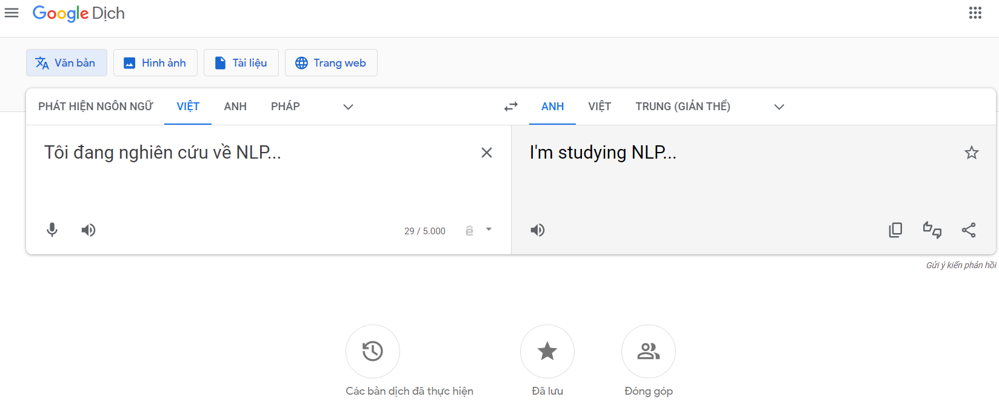

# **Vietnamese-English machine translation project**

## Project Description
\
&nbsp;&nbsp;&nbsp;&nbsp;**Machine Translation**, also known as automatic translation, is a subfield of Computational Linguistics with the aim of automatically translating text or speech from one natural language to another. Machine Translation combines ideas and techniques from linguistics, computer science, probability statistics, and artificial intelligence. The ultimate goal of Machine Translation is to develop a system that can produce accurate translations between the natural languages used by humans.

&nbsp;&nbsp;&nbsp;&nbsp;The current typical Machine Translation systems, such as Google Translator, Bing Translator, etc., have achieved good translation quality and have been integrated into various application platforms. They are capable of accurately translating between over 100 different natural languages.

&nbsp;&nbsp;&nbsp;&nbsp;Therefore, the input/output of the machine translation task are:
- **Input:** The input text in the source language.\
*Example:* The input sentence in Vietnamese: "Tôi đang nghiên cứu về NLP" (I'm studying NLP).
- **Output:** The text translated into the target language.\
*Example:* The sentence translated into English: "I'm studying NLP".

&nbsp;&nbsp;&nbsp;&nbsp;The problem of machine translation is modeled to train and 
optimize the model parameters $θ$ with the input text in the source language $w(s)$ and the corresponding output text in the target language $w(t)$:

$$ŵ^{(t)} = argmax_{(w(t))}θ(w(s), w(t))$$

&nbsp;&nbsp;&nbsp;&nbsp;Currently, there are three main approaches for this problem:
- **Approach 1:** Rule-based Machine Translation (RBMT)
- **Approach 2:** Statistical Machine Translation (SMT)
- **Approach 3:** Neural Machine Translation (NMT)

&nbsp;&nbsp;&nbsp;&nbsp;Among these approaches, NMT is increasingly being developed and offers superior translation quality. Therefore, the project focuses on neural network-based methods, including three main contents:
- **Method 1:** Building a machine translation model using the Transformer architecture
- **Method 2:** Building a machine translation model using pre-trained models such as BERT and GPT
- **Method 3:** Building a machine translation model using the mBART model with pre-trained mBART50.

## Getting Started

To get started, follow these simple steps:

1. Clone this repository: `git clone https://github.com/myusername/myawesomeproject.git`
2. Install the necessary dependencies: `npm install`
3. Run the project: `npm start`

That's it! You should now see the project running at `http://localhost:3000`.

## Features

This project comes with the following features:

- **Feature 1:** Allows you to do [something amazing].
- **Feature 2:** Helps you achieve [an awesome goal].
- **Feature 3:** Saves you time by automating [a tedious task].

## Contributing

We welcome contributions from everyone! If you'd like to contribute, please follow these steps:

1. Fork this repository.
2. Create a new branch: `git checkout -b my-new-feature`
3. Make your changes and commit them: `git commit -am 'Add some feature'`
4. Push your changes to your fork: `git push origin my-new-feature`
5. Submit a pull request.

## Issues

If you encounter any issues while using this project, please [open a new issue](https://github.com/myusername/myawesomeproject/issues/new). We'll do our best to address it as soon as possible.

## License

This project is licensed under the MIT License. See the [LICENSE.md](LICENSE.md) file for details.

---

Made with :heart: by KV
